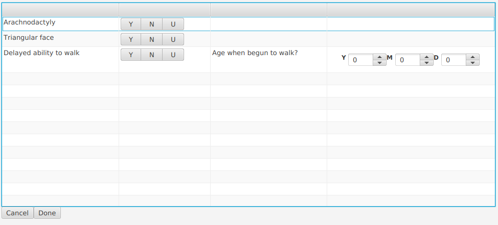

######
README
######

PhenoQ is a Java 17 JavaFX app that demonstrates how to create a Questionnaire widget that can be used to
get data needed to add to a Phenopacket from users based on two types of question.




The first question type just asks if an HPO term was observed, excluded or whether there is no information availble (unknown).

The secod question is intended to be used to assess whether there is delayed or accelerated development and
the user can optionally enter an age that will trigger the HPO term according to a built-in threshold.


Setup
#####

Adjust the path to the ``hp.obo`` file in the application.properties file.
```
spring.application.ui.title=PhenoQ
application.version=0.0.0.0.1
hpo.path=/home/peter/data/hpo/hp.obo
```